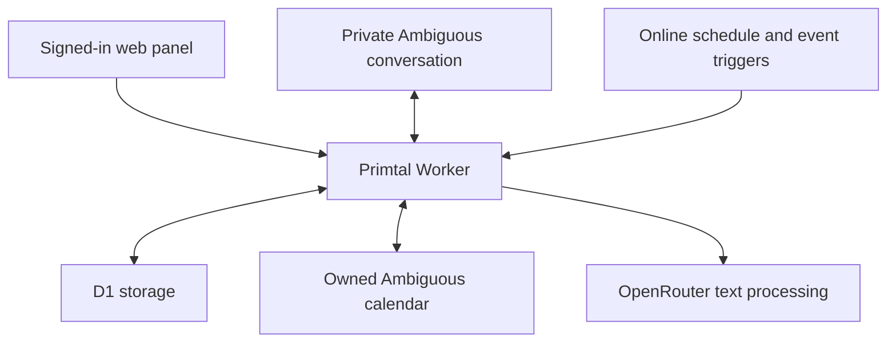

# Primtal architecture

[Documentation home](../README.md) · [Operations](OPERATIONS.md)

Primtal has two participant-facing surfaces: the Ambiguous direct conversation and a hosted web panel. Both call the same server-side workflow and act on the participant established by their verified account binding.

## Components

| Component | Responsibility |
| --- | --- |
| React and TypeScript panel | Pairing, preferences, current cards, explicit actions, presentation preparation and setup help. |
| Hosted Worker using vinext | Authenticated routes, participant resolution, workflow orchestration and provider calls. |
| Ambiguous | Agent identity, two-member DMs, native choice cards, shared personal calendars and online automations. |
| D1 and Drizzle schema | Provider configuration, participant bindings, encrypted application payloads, workflow state and write journals. |
| OpenRouter | Free-text safety routing, setup-assistant replies and credential/model verification. |

The setup assistant is a separate help path. It does not receive live calendar data or use calendar action tools. Model output cannot directly authorise a calendar write.

## Two identity domains

The hosting platform supplies the signed-in web identity. Ambiguous supplies workspace, participant and DM identities. A generated `PAIR` command proves that the web user controls a particular private conversation. The code is hashed, expires after 10 minutes and is consumed on use.

Participant records are scoped by workspace and Ambiguous user. A web binding resolves to that participant; ordinary action endpoints do not accept an arbitrary participant ID. The backend verifies the exact two-person DM and the selected calendar's ownership.

Site access, Ambiguous workspace membership and GitHub collaboration are independent. Provider ownership is also separate from participant ownership. The hosted release hides provider administration from teammates and permits a paired teammate to use the shared setup assistant. See the [release note](OPERATIONS.md#hosted-release-and-repository) for the repository snapshot difference.

## Entry points

| Route | Methods | Purpose and boundary |
| --- | --- | --- |
| `/api/connections` | GET, POST | Owner-only provider status and validation. Does not return saved credentials. |
| `/api/pair` | POST | Generates a pairing command for the signed-in web account. |
| `/api/checkin` | GET, POST | Reads and advances the account's paired workflow; settings, answers, review, confirmation, undo and stop. |
| `/api/history` | GET, POST | Reads preparation status and prepares/removes synthetic answers for the paired participant. Calendar preparation writes real events. |
| `/api/automation` | POST | Connection-owner activation of online processing. |
| `/api/runner` | POST | Background processing and owner operations protected by a server credential; not a public launch URL. |

The assistant has its own authenticated streaming transport. User-facing mutations check same-origin requests as well as identity and participant binding. Runner requests use dedicated server authentication instead of browser identity.

## State and background execution

The current session carries the question index, domain answers, optional note, safety state, follow-up queue, current outgoing card and calendar proposal. Each outgoing card has a reference and delivery state. Stale votes and stale web requests cannot silently apply to the next question.

Participant locks serialize overlapping work. Calendar writes record pending/in-progress/confirmed or uncertain states. External effects cannot be made transactional with D1, so uncertain writes require calendar inspection before another attempt.

An Ambiguous minute schedule calls the hosted runner. Supported message events can wake it earlier. While choice cards are active, bounded Worker continuations check votes; the minute schedule also provides recovery. The visible panel performs an additional refresh/poll approximately every five seconds. None of these requires the owner's computer to remain online.

Reminder eligibility uses the participant's local date and configured time. It sends at most the scheduled daily start for that date, after the time is reached, when there is no active unfinished flow. There is currently no weekday-only reminder setting.

## Storage model

| Table | Main contents |
| --- | --- |
| `participants` | Workspace/user identifiers and encrypted participant preferences, DM, calendar and consent information. |
| `bindings` | Web identity to participant relationship. |
| `pairings` | Hashed pending pairing code and expiry. |
| `sessions` | One current encrypted session per participant and update metadata. |
| `checkins` | Encrypted completed check-in payloads indexed by participant and day, including separately identified synthetic records. |
| `settings` | Encrypted provider configuration plus operational records such as automation IDs, heartbeats and write journals. |
| `locks` | Short-lived execution leases. |

Application payload encryption uses AES-GCM. Indexing and operational metadata are not all encrypted, and this is not end-to-end encryption. See [Privacy and data](PRIVACY-AND-DATA.md).

## Source map

The application root is [apps/agent](../../apps/agent).

| Area | Source |
| --- | --- |
| Main panel | [page](../../apps/agent/app/page.tsx), [check-in controls](../../apps/agent/app/demo-panel.tsx), [presentation controls](../../apps/agent/app/history-panel.tsx) |
| Questions and state transitions | [questions](../../apps/agent/lib/primtal/questions.ts), [workflow](../../apps/agent/lib/primtal/workflow.ts) |
| DM processing and pairing | [runner](../../apps/agent/lib/primtal/runner.ts), [participants](../../apps/agent/lib/primtal/participants.ts) |
| Native choice delivery | [message cards](../../apps/agent/lib/primtal/message-cards.ts) |
| Calendar comparison and actions | [patterns](../../apps/agent/lib/primtal/patterns.ts), [calendar actions](../../apps/agent/lib/primtal/calendar-actions.ts) |
| Synthetic preparation | [history](../../apps/agent/lib/primtal/sample-history.ts), [today's blocks](../../apps/agent/lib/primtal/demo-calendar.ts) |
| Provider adapters | [Ambiguous](../../apps/agent/lib/primtal/ambiguous.ts), [OpenRouter](../../apps/agent/lib/primtal/openrouter.ts) |
| Database and encryption | [schema](../../apps/agent/db/schema.ts), [store](../../apps/agent/lib/primtal/store.ts) |
